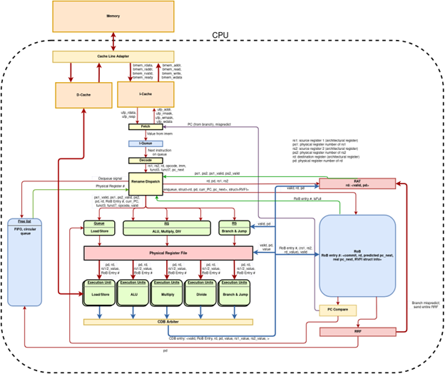
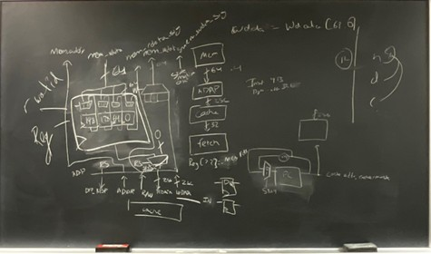

# Coremelters
``` 
By Arnav Sheth, Bikrant Das Sharma, Yash Gupta
ECE 411, 12/11/
```
## Introduction

The out-of-order (OOO) processor is key to modern CPU architectures. OOO enables many
performance benefits, including lower latencies, increased throughput, and improved
dependency handling. As such, implementing an OOO processor is a fundamental stepping
stone in the education of computer architecture students. Therefore, as part of our “ECE 411:
Computer Organization and Design” class at the University of Illinois, Urbana-Champaign, our
group developed an OOO RISC-V processor.

The overarching goal of this report is to detail the development of our OOO processor. At a high
level, our processor is a RISC-V out-of-order processor that supports the RV32-IM instruction
set architecture. Out-of-order (OOO) is a fundamental necessity in the development of our
processor, as it allows a single core processor to exploit Instruction Level Parallelism (ILP), by
executing instructions as soon as possible rather than in their specified order. Compared to a
traditional in-order processor, OOO utilizes dynamic scheduling, which exploits instruction level
parallelism (ILP) at run-time, resulting in greater throughput and gracefully handling
dependencies at run-time. This can result in multiple instructions running in parallel and
progress being made even when an instruction is stalled.

This report is broken down into the following sections: Project Overview, Design Description,
Additional Observations, and Conclusion. The Design Description is the heart of the report,
covering the progress, details, and design implementations of various features.

## Project Overview

This course, ECE 411, features a competition which ranks each team’s processor performance
against several test programs. The goal of this project and competition is to develop an
out-of-order processor that has excellent performance as measured by power, area, and
instructions per cycle (IPC).

Our overall approach to the project was the following. The first goal was to develop a fully
functional OOO processor based on the explicit register renaming (ERR) scheme. After that, we
identified performance bottlenecks in our design, added optimizations, and re-measured
performance. Through repeating this process, we achieved our final processor.

We heavily used a Git workflow, where the main branch would hold our current baseline
processor. Branches were created for additional features, and the feature would be fully


implemented on the branch. Once the branch was tested for correctness, IPC performance,
timing, and synthesizable, we would merge the branch into the main branch. Each feature was
implemented by one to two group members.

Notable achievements of our final processor: out of all the processors that beat the baseline
performance, our processor had the lowest power consumption and one of the lowest, if not the
lowest, area. This was in line with our goal to try to win the competition by minimizing power and
area, while trying to improve IPC within these bounds.

## Design Description

### Overview

Our design used explicit register renaming (ERR). The basic principle behind ERR is to assign
each architectural register (register specified by the ISA) to a physical register. All instances of
the architectural register are substituted with its corresponding physical register. The mapping of
architectural register to physical register is kept track of by the Register Alias Table (RAT). Once
a physical register is assigned to an architectural register, it cannot be allocated to another
architectural register until that architectural register is assigned a new physical register.

Shown below is a diagram of our baseline processor. We will explain the basics of our processor
design here. Instructions come from memory through the cache line adapter and are put into the
instruction cache (I-Cache). The fetch unit will grab instructions from the I-Cache and place
them into the instruction queue. The decode unit will take the next instruction from the queue
and classify it by looking at the instruction’s opcode, destination register, source registers,
immediate values, funct3, and funct7. _Note: RISC-V ISA has many different types of
instructions, and not all instructions have all the aforementioned components._


```
Fig 1. Block-level Diagram of baseline processor
```
Once the instruction is decoded, the next step is register renaming. For source registers, we find
the corresponding physical register in the RAT. For the destination register, we assign a new
physical register from the free list (a queue). The assigned physical register is then added to the
RAT.

After renaming, the instruction is dispatched to the appropriate reservation station (Load/Store,
ALU/Mult/Div, Branch/Jump). Additionally, it is also placed on the reorder buffer (RoB), so that
the actual instruction ordering is preserved.

Instructions, then, wait on the reservation station until all of their dependent values are
computed and the execution unit is free to take the instruction. Once the instruction has been
calculated by its respective execution unit, it is put on the common data bus (CDB). The CDB
broadcasts the value to the reservation stations, register file, RAT, and ROB.


The ROB is also a queue. It holds the in-progress instructions and keeps track of whether they
have been completed or not. Once the CDB broadcasts the result of an instruction to the ROB,
the ROB will mark this instruction as ready to be committed.

The Register Rename File (RRF) is the final structure in the OOO processor. It is similar to the
RAT, in that it stores a mapping of architectural registers to physical registers. The difference is
the RRF only contains committed mappings, while the RAT will have some speculative values.

The RRF will dequeue the ROB only when the instruction at the head of the ROB is ready to be
committed. If dequeued, the RRF stores the new architectural to physical register mapping and
sends the prior stored physical register to the freelist.

In the case of a branch mispredict, the RRF will send out a flush signal that instructs the various
reservation stations, fetch queue, freelist head/tail pointers, execution units, ROB, etc. (all
locations holding speculative values) to flush their values. This also means that the RAT reverts
back to its last committed state via the RRF.

One decision choice that can be seen in the diagram is that there are multiple reservation
stations. We decided to use a combination of split and unified reservation stations in our design,
as it simplifies our logic’s complexity.

### Milestones

#### Checkpoint 1

Our Checkpoint 1 implementation was primarily designing the fetch stage and the burst memory
controller. The implementation was very similar to that of a simple pipelined processor. We used
a cache as an instruction buffer. Our initial implementation of the burst memory controller was
very basic. It would send data and hold on until sending the value again until it received a
bmem_resp. We also implemented a well-designed queue which could be implemented of size
0. This allowed us to have registers with information such as whether the register was empty or
not.


```
Fig 2: Brainstorm of how Burst Memory Controller and fetch stages work
```
#### Checkpoint 2

For Checkpoint 2, we implemented most of our execution units and used a unified reservation
station. We also used Synopsys IP to implement a multiplier and divider which allowed us to
implement difficult-to-speed-up operations in just a few man-hours. All of the execution units
were modeled as queues which allowed us to abstract the CBD arbiter as just a device for
dequeuing non-empty queues. For testing, we used a random test generation scheme which
exercised a random sequence of instructions with random values. Normally this scheme breaks
down due to a lack of memory modelling, however at this stage we did not implement any
memory operations.

```
Fig. 3: Brainstorming of decode, rename, and dispatch units, later combined
```

#### Checkpoint 3

At this part of the MP, we had finished most of our basic features and were able to achieve an
IPC of around 0.22 on the coremark benchmark. We implemented a joint load-store execution
unit which handled both types of instructions. Branches and JALR instructions were also
implemented as a separate execution unit. We added 2 additional inputs to our CDB arbiter to
choose between the 5 functional units. For this checkpoint, we used a naive round-robin arbiter.

We also added branch mispredict handling to our processor at this point. The RRF outputs a
stall bit, the actual next program counter (PC), and the order of the branch mispredicted
instruction. All three of these inputs go to the fetch stage so that it can load the proper next
instruction and use the correct order for RVFI. The branch mispredict signal is forwarded to
multiple units, including the fetch, fetch queue, RAT, and functional units. On a flush, all of these
structures and units have their reset bit toggled. Additionally, the RRF also forwards its entire
table to the RAT. We did not add any registering of the stall signal in this design. As a result, our
longest critical path ended up being the branch mispredict logic as it touches the majority of
units in our processor.

```
Fig. 4: Rough sketch of how the Loads and stores should be handled
```

```
Fig. 5: Rough idea for how the burst memory controller should work with both caches
```
### Advanced Design Options

#### Split L.S.Q. with O.O.O. Loads w.r.t. Store Addresses

This structure makes load operations execute early by checking if worst case dependencies
truly exist.

Prior to this optimization, all load and stores were put into a queue such that all memory bound
operations happened in program order. This gave a simple way to handle WAR (Write after
Read), RAW (Read after Write), and WAW (Write after Write) dependencies – as each load
happened after its appropriate store. This is a fine implementation if loads and stores occur
rarely. However most of the time, there is not any point to having an ordering since the pending
loads and stores may not even address the same 4-byte aligned memory address. This means
loads and stores can be done out-of-order.

To reduce the chance a load stays on the ROB head for more than 1 cycle, we split the
Load/Store (LD/ST) queue into a LD reservation station and a ST queue. The ST queue
maintains previous behavior. The newly made LD reservation station (RS) holds the same load
entry, but now with pointers to conflicting store entries (stored as a bitmask). When a load entry
no longer points to any stores, the LD RS outputs a load operation to the data arbiter.

Using the ST queue we are able to handle WAW dependencies as before, and partial
RAW/WAR dependence using the bitmask. However, as before to fully handle WAR and RAW,
the data arbiter was programmed to give higher precedence to stores, in case a store and a
load are ready at the same time.


When comparing an earlier version of design with a split LSQ and one without, we saw a
dramatic difference in our performance counters for fft.elf program – however not much of an
IPC change. We noticed that we are able to significantly reduce instances of loads being on the
ROB head for more than 1 cycle (shown on the x-axis where cycles are greater than 0). Note
that in the split L.S.Q. (Load Store Queue) there are 4 store queue entries and 4 load
reservation station entries, however in the non-split-lsq there are only 4 queue entries in total.
This increase in LD/ST entry slots could bias the results.

```
Fig. 6: Number of extra cycles(past first cycle) a load operation is on the head of the ROB for
fft.elf. Left is without a split LSQ and the right is with a split LSQ. Data might have deviation due
to use of Verilator and VCS to run performance counters. The clock frequency was 400 Mhz for
this comparison.
```
#### Post Commit Store Buffer

This optimization speeds up load operations, by combining stores together, as successive (or
relatively successive) stores happen at the same 4-byte aligned address.

We implement this by using 4 reservation stations which each hold a 4-byte aligned address
(30-bits), a 4-bit mask, and a word of data (32-bits). So, whenever a store is to be done, the
arbiter checks if the store’s address is in the PCSB. If it is, then the arbiter updates the PCSB
and signals to the CDB arbiter that it is ready to broadcast an output. If not then the arbiter
sends the least recently allocated PCSB entry to data cache and replaces it with the current
store operation (unless there is an empty entry in the beginning). This means that only PCSB
hits are sped up – taking advantage of coalescing stores. In effect, this reduces the number of
cycles some stores are on the head of the ROB by cutting away the time it would have taken to
talk to memory.

The benefits of this optimization are best seen when it’s compared against our final submission
with a split LSQ. This is since the PCSB is mainly an optimization within the data cache arbiter
(a single file). As shown below, there is a drastic difference seen in fft.elf where a portion of the
stores are made to stay on the head for 1 less cycle. However, the IPC gain for fft.elf is marginal
(up from 0.493955 to 0.498970).


```
Fig. 7: Number of extra cycles a store operation is on the ROB head for fft.elf. Above is without
PCSB and below is with PCSB. Data might have deviation due to the possible use of Verilator
and VCS to run performance counters. The clock frequency was 520.291 Mhz for this
comparison. Both use 2 store queue entries and 2 load reservation station entries.
```
#### Next Line Prefetcher

A next line prefetcher predicts and preloads the cache lines likely to be accessed next, based
on the assumption of sequential memory access patterns. While simple in concept, advanced
designs aim to improve accuracy, reduce overhead, and adapt to varying workloads. Our next
line prefetcher was accompanied with a revamp of the burst memory controller. The revamp
allowed for a non-blocking implementation of the controller. It was based on a reservation
station style implementation. The next line prefetcher would predict the next line to be used
(icache_addr+32’h20) and request that value from memory. If the predicted value was incorrect,


it would go and request a new value. When correct, the prefetcher will request more values.
This allowed the prefetcher to reach an accuracy of around 90% of the values requested for
coremark.

The images below compare the number of cycles it took to complete a request from I-cache.

The first figure shows without a prefetcher and the second one is with the prefetcher.


```
Fig. 8: The top graph shows the number of cycles to complete coremark requests prior to the
prefetcher. The second graph shows the number of cycles after adding the prefetcher. Note that
the second figure’s y-axis is on a logarithmic scale. It is visible that most requests took about 10
cycles, but there’s a longer tail since a failed prefetch requires a memory request.
```
#### Two-Level Predictor

This structure uses past branch predictions and the current instruction address to predict if a
branch is taken. This is an improvement over our RISC-V branch policy suggestion as it allows
for the design to accommodate branches which deviate from the norm.

To reduce our area we chose to use a mini decoder in the fetch unit to predict the target
destination. Also, to save area, we used a dual-ported SRAM which allows us to read and write
to the table, instead of using flip-flops.

When the fetch unit sends a request to I-cache, the PC is also sent to the branch predictor.
Then, in the next cycle we decode the I-cache response and compare it against the predictor’s
output. If the fetched instruction is a branch and the predictor predicts the branch is taken, then
the next PC is offset by the branch instruction’s offset.

Whenever the branch execution unit calculates a branch’s output, the branch table is updated
using the SRAM’s second port. This uses a 2-cycle update where in the first cycle, the entry’s
value is read and then, in the next cycle, the entry’s value is updated.

However, unlike the table, we update the GHR separately in 2 different places: first, when a
branch is being enqueued into the fetch queue and, second, when there is a flush from the RRF.
When a branch is enqueued, the GHR has the branch prediction left shifted in. However, when
the RRF issues a flush, the GHR from the flushed instruction is reset into the branch predictor’s
GHR. Note that upon further inspection, we noticed that the GHR is not updated during a flush.
This could be done by inverting the least significant bit of the new global history, correcting the
incorrect prediction.

Regardless, we did see a marked improvement in our committed branch accuracy when we
shifted to using a 2-level predictor with 1 bit of GHR with 256 entries (512 in total) featuring 2-bit
saturating counters. Our committed branch accuracy went from ~81% to ~89% in coremark,
~66% to ~78% in mergesort, and stayed the same at ~90% in compression. This is good as
branches make up ~18%, ~17.6%, ~12% of all committed instructions for coremark_im.elf,
mergesort.elf, and compression.elf, respectively.

While the comparison being carried out uses an older version of our processor, we saw our IPC
go from ~.543 to ~.569 for coremark, ~.546 to ~.579 for mergesort, and stay relatively the same
at ~.690 for compression(very marginally lowered actually). We weren’t however able to
significantly speed up aes_sha.elf or fft.elf, probably due to their single digit percentage of
branches. In fact, we slightly decreased IPC on aes_sha.elf.


Ultimately, we chose to set the GHR to have 0 history bits, as this gave us the best branch
prediction accuracy on our local test cases.

#### Design Space Exploration Scripts

Early in our development process, we identified that Verilator support would be essential to
determine ideal hyperparameter tuning. This paid off for us when we got around to Design
Space Exploration. We developed a Python script which would run all five testbenches
(coremark, aes, compression, mergesort, and fft) with selected hyperparameters, and store the
results. Then, we developed a separate script which would go through the results of the runs
and pick out the top performing hyperparameters. This script resides in the space_x branch.

#### Benchmark Analysis

To do benchmark analysis, we inserted “sniffers” into our SystemVerilog test bench. These
“sniffers” monitored particular values of the RoB, cache line adapter, fetch queue, and causes of
stalls. These sniffers dumped the values of the selected signals to a log file every cycle. Then,
we had a Python script which would go through these results and draw metrics which we could
use to determine bottlenecks in our processor.

Shown below is one of the figures from our coremark benchmark analysis. The following
histogram shows the frequency of various instruction types and how many cycles the instruction
types stay on the head of the RoB before being committed. This gives insight into which
instructions are taking the longest to complete, and therefore bottlenecks in the performance of
the processor. As one would expect, from the diagram presented below, store instructions seem
to take the longest on average out of all the other instructions in this simulation.


#### Parameterized Ways and Sets

N-Ways PLRU and Parameterized Sets allowed us to manipulate the size and dimensionality of
the cache. The cache, while being a black box, was an important tool that allowed us to
manipulate the area and power gains with very insignificant loss in performance. The difference
in area between a 4-way 16-set cache and a 2-way 32-set cache was about 16% for loss of 1%
in performance. This feature helped in improving the PD^3 A1/2 of all the test cases.


#### Return Address Stack

The Return Address Stack (RAS) is a hardware mechanism used in RISC-V processors to
optimize the performance of function calls and returns. By maintaining a stack-like structure that
stores return addresses, the RAS improves the accuracy of return address prediction, which is
crucial for speculative execution for JAL/JALR’s. Without an effective RAS, the processor would
need to rely on general branch mispredict recovery for JALR instructions, which is significantly
more costly due to many wasted cycles.

As you can see from the figure below with the RAS we were able to drastically reduce the no of
JALR’s mispredicted. The RAS allowed us to improve very small amounts of performance for
almost no loss in power or area.

## Additional Observations

One cool implementation we had is a Python script which aids in removing circular combination
logic warnings in Verilator. When given a always_comb block and programmed with a list of n
problematic logics, the code generates n copies of the always_comb block where only the
problematic variable is assigned a value. This helps in speeding up trial-and-error removal of
Verilator circular combinational loops, however it is limited to simple logic and requires a bit of
manual preprocessing – such as placing begin/end on separate lines, having unique variable
names which don’t contain other variable names as substrings, etc.

Late in the competition, we realized that we had implemented state machines which could be
optimized to reduce the total number of states. Fully optimizing these state machines could
have potentially given us better performance since our transition path from one state back to the
base state could be reduced by a cycle or more.

Our final processor had one of the lowest power consumptions and areas in the competition, in
fact it was the lowest amongst the top 10 processors (based on the “AG Leaderboard
mp_ooo_comp 2024-12-06T23:59:59-06:00” autograder run). During the final minutes of the
competition, in order to achieve a top spot in the leaderboard, we tried improving our IPC at the
cost of upticks in power and area. In hindsight, we should have stuck to our power and area
approach, as sacrifices in power and area did not help our IPC.

## Conclusion

In a period of about a month, we created an OOO ERR processor which is able to efficiently
process RV32-IM instructions. Along the way, we learn how to make custom made performance
counters, such that it would be competitive in the final design.


Based on the thoughts of multiple TAs and our personal observations, we recognized that
despite all our advanced features, the simple things may dictated our performance the most.
This would include how our state machines were built, the number of bits we stored inside the
various reservation stations, or even how we expressed logic.

Overall, this project was a rewarding experience. We gained a deep understanding of OOO
processor design, implementing advanced features detailed in research papers, and invaluable
debugging and analysis skills.


